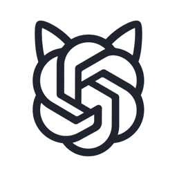
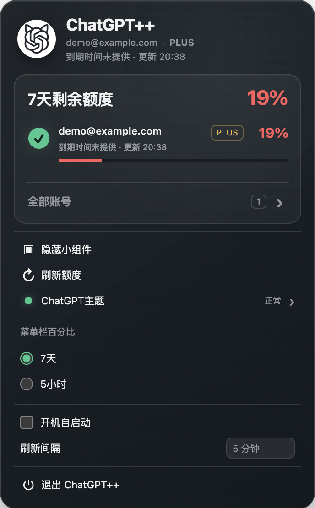
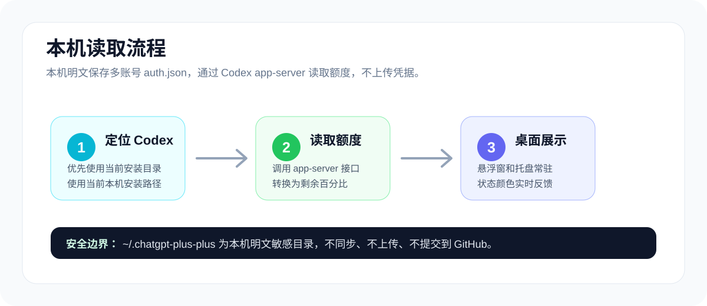
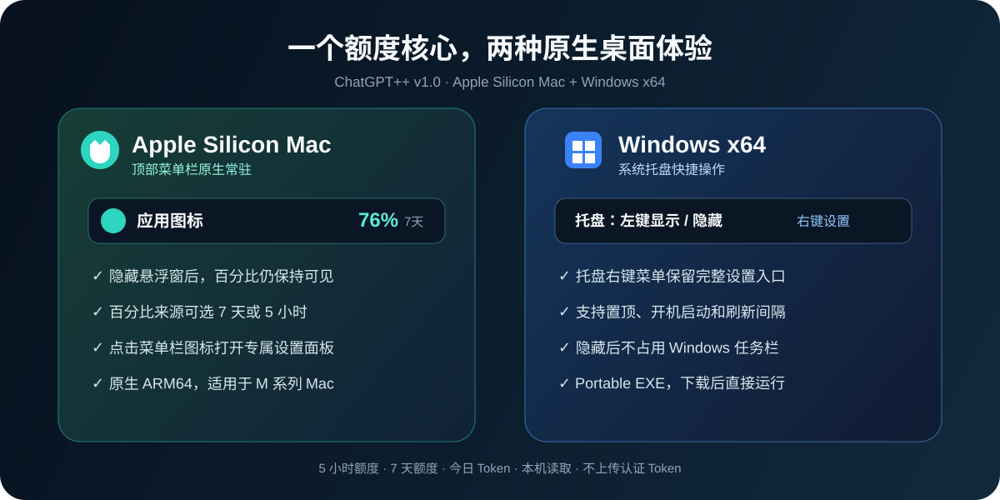

# ChatGPT++

<p align="center">
  中文说明 · <a href="README_EN.md">English</a>
</p>

<p align="center">
  
</p>

<p align="center">
  <br />
  <strong>在桌面集中管理本地 ChatGPT / Codex 账号、订阅状态与剩余额度。</strong><br />
  支持 Windows x64 与 Apple Silicon Mac，账号凭据只保存在当前电脑。
</p>

<p align="center">
  <a href="https://github.com/1nuYasha-cck/ChatGPT-Plus-Plus/releases/tag/v1.0"></a>
  
  
</p>

> ChatGPT++ 是非官方第三方本地工具，与 OpenAI 无隶属或背书关系。

## 下载

前往 [ChatGPT++ v1.0 Release](https://github.com/1nuYasha-cck/ChatGPT-Plus-Plus/releases/tag/v1.0)：

| 平台 | 文件 | 使用方式 |
| --- | --- | --- |
| Windows x64 | `ChatGPT-Plus-Plus-1.0.0-win-x64.exe` | 免安装，双击运行 |
| Apple Silicon Mac | `ChatGPT-Plus-Plus-1.0.0-mac-arm64.zip` | 解压后打开 `ChatGPT++.app` |

Windows 包暂未签名，Mac 包使用 ad-hoc 本地签名。首次启动可能需要在系统安全设置中确认来源。

## 界面预览

以下截图使用演示账号，不包含真实用户数据。

<table>
  <tr>
    <td align="center"></td>
    <td align="center"></td>
  </tr>
  <tr>
    <td align="center"><strong>当前账号</strong><br />默认保持紧凑，只显示当前账号、套餐与剩余额度</td>
    <td align="center"><strong>全部账号</strong><br />展开后可添加、导入或勾选其他账号完成切换</td>
  </tr>
</table>

## 核心功能

### 多账号保存与切换

- 首次运行可识别当前电脑已有的 Codex 登录。
- 点击“添加账号”跳转官方登录流程，登录成功后自动保存。
- 也可手动导入有效的 `auth.json`。
- 每个账号使用独立 Profile 读取额度；切换时备份、原子替换并校验当前登录，失败自动回滚。
- 切换成功后显示稳定的重启提示，可立即重启或稍后手动重启 ChatGPT。

### 账号、订阅与额度状态

- 显示实际账号名称或邮箱以及 `FREE`、`PLUS`、`PRO` 等套餐。
- 从可用的官方账号数据读取订阅到期时间；无有效日期时显示“到期时间未提供”，不会显示错误的 `1970-01-01`。
- 显示额度最后更新时间和 5 小时、7 天剩余额度。
- “全部账号”默认收起，展开后集中查看每个本地账号的剩余额度。
- 额度颜色统一为：40% 及以上绿色、20%–39% 琥珀色、低于 20% 红色。

### 菜单栏、托盘与悬浮组件

- Mac 菜单栏持续显示图标和选定额度，可在 7 天与 5 小时之间切换。
- Windows 托盘支持显示/隐藏、刷新、账号切换和 `auth.json` 导入。
- 桌面组件支持置顶、自由缩放、开机启动和 1/5/15/30/60 分钟刷新间隔。
- 今日 Token 统计只读取当前电脑的 `.codex/sessions` 日志。

### ChatGPT 主题

- 主题入口改为点击后打开，避免鼠标悬停误触。
- 主题菜单按被点击按钮的实际坐标定位，并随内容动态收缩，减少底部空白。
- 支持主题状态检查、已有主题切换和自定义主题工作流。

## 工作方式

<p align="center">
  
</p>

ChatGPT++ 通过当前电脑安装的 Codex `app-server` 获取用量快照，不调用网页抓取。账号切换的目标是本机 `CODEX_HOME/auth.json`，不会修改远程账号本身。

## 平台特性

<p align="center">
  
</p>

| 平台 | 主要体验 | 发布格式 |
| --- | --- | --- |
| Apple Silicon Mac | 菜单栏额度、紧凑账号面板、Dock 自动隐藏、ChatGPT 主题 | ARM64 `.zip` |
| Windows x64 | 悬浮组件、托盘原生菜单、便携运行 | Portable `.exe` |

## 隐私与安全

本项目按产品设计使用本地明文 JSON 保存账号：

- 完整凭据位于 `~/.chatgpt-plus-plus/profiles/<账号ID>/auth.json`，不会由 ChatGPT++ 上传。
- `accounts.json` 保存账号展示元数据和当前账号指针。
- Unix 系统下账号目录使用 `0700`、账号文件使用 `0600` 权限。
- 设置保存在当前系统用户的 Electron `userData` 目录，每台电脑相互独立。
- 新电脑采用默认配置；如果本机已经存在 Codex 登录，首次启动会导入该电脑自己的登录。
- 构建后自动扫描 ASAR 和附加资源，阻止账号、设置、日志、备份、绝对用户路径、邮箱、Token 和敏感图片元数据进入发布包。

明文凭据仍属于敏感数据，请保护操作系统账号和磁盘，不要同步或提交 `~/.chatgpt-plus-plus/`、`~/.codex/auth.json`。

## 本地开发

要求 Node.js 20 或更高版本。

```bash
git clone https://github.com/1nuYasha-cck/ChatGPT-Plus-Plus.git
cd ChatGPT-Plus-Plus
npm install
npm run dev
```

常用命令：

| 命令 | 作用 |
| --- | --- |
| `npm test` | 运行完整测试 |
| `npm run qa:menu` | 生成菜单栏交互预览并验证动态高度 |
| `npm run qa:theme` | 验证主题菜单交互与高度 |
| `npm run build` | 构建 Windows x64 便携版并执行隐私审查 |
| `npm run build:mac` | 构建 Mac ARM64 应用、签名并执行隐私审查 |
| `npm run audit:privacy` | 单独审查现有双平台产物 |

## 项目结构

```text
ChatGPT-Plus-Plus/
├── assets/       # 应用图标与 README 图形
├── docs/images/  # 已脱敏的功能截图
├── scripts/      # QA、图片元数据和打包隐私审查
├── src/main/     # Electron 主进程、账号、额度和主题服务
├── src/renderer/ # 悬浮组件、菜单栏和主题界面
├── test/         # Node 测试与安全契约测试
└── vendor/       # 运行时所需的主题引擎资源
```

## 说明与限制

- 需要当前电脑安装并登录 ChatGPT/Codex，或提供可用的 Codex `auth.json`。
- 账号套餐、订阅到期时间和额度以本机 Codex/OpenAI 当前返回的数据为准。
- 当前仅提供 Windows x64 与 Apple Silicon Mac；暂不提供 Intel Mac 和 Linux 构建。
- 项目不会尝试绕过 OpenAI 的身份验证、订阅或额度限制。

## 开源协议

[MIT License](LICENSE)
