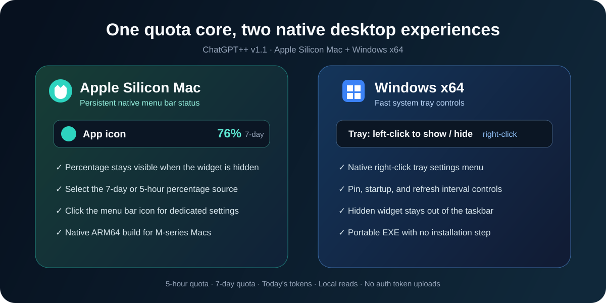

# ChatGPT++

<p align="center">
  <a href="README.md">中文说明</a> · English
</p>

<p align="center">
  
</p>

<p align="center">
  <br />
  <strong>Manage local ChatGPT / Codex accounts, subscription status, and remaining quota from one desktop app.</strong><br />
  Available for Windows x64 and Apple Silicon Mac. Credentials stay on the current computer.
</p>

<p align="center">
  <a href="https://github.com/1nuYasha-cck/ChatGPT-Plus-Plus/releases/tag/v1.0"></a>
  
  
</p>

> ChatGPT++ is an unofficial third-party local utility. It is not affiliated with or endorsed by OpenAI.

## Download

Open the [ChatGPT++ v1.0 Release](https://github.com/1nuYasha-cck/ChatGPT-Plus-Plus/releases/tag/v1.0):

| Platform | File | Usage |
| --- | --- | --- |
| Windows x64 | `ChatGPT-Plus-Plus-1.0.0-win-x64.exe` | Portable; run directly |
| Apple Silicon Mac | `ChatGPT-Plus-Plus-1.0.0-mac-arm64.zip` | Extract and open `ChatGPT++.app` |

The Windows package is currently unsigned. The Mac package uses an ad-hoc local signature. Your operating system may request manual approval on first launch.

## Preview

The screenshots below use demo data and contain no real user account information.

<table>
  <tr>
    <td align="center"></td>
    <td align="center"></td>
  </tr>
  <tr>
    <td align="center"><strong>Current account</strong><br />A compact default view with the active account, plan, and quota</td>
    <td align="center"><strong>All accounts</strong><br />Expand to add, import, or select another local account</td>
  </tr>
</table>

## Features

### Local multi-account switching

- Detects an existing Codex login on first launch.
- Opens the official login flow from Add Account and saves the successful login automatically.
- Imports a valid `auth.json` when preferred.
- Reads every account through an isolated profile; switching uses backup, atomic replacement, validation, and automatic rollback.
- Shows a persistent restart prompt after switching, with Restart Now and Later choices.

### Account, subscription, and quota status

- Displays the actual account name or email and plans such as `FREE`, `PLUS`, and `PRO`.
- Uses available official account metadata for the subscription end date. Missing dates are shown as unavailable instead of the incorrect `1970-01-01`.
- Shows the last quota update time plus 5-hour and 7-day remaining quota.
- Keeps All Accounts collapsed by default and expands it to show every local account.
- Uses consistent thresholds: green at 40% or above, amber from 20% to 39%, and red below 20%.

### Menu bar, tray, and floating widget

- macOS keeps the app icon and selected remaining quota in the menu bar.
- Windows provides tray controls for show/hide, refresh, account switching, and `auth.json` import.
- The floating widget supports always-on-top, resizing, startup launch, and 1/5/15/30/60-minute refresh intervals.
- Today's token count is read only from local `.codex/sessions` logs.

### ChatGPT themes

- Opens the theme menu on click instead of hover.
- Anchors the popup to the actual clicked row and resizes it to content to remove extra blank space.
- Supports theme health checks, saved-theme switching, and custom theme workflows.

## How it works

<p align="center">
  
</p>

ChatGPT++ reads usage snapshots through the locally installed Codex `app-server`; it does not scrape web pages. Account switching replaces the local `CODEX_HOME/auth.json` and does not modify the remote account itself.

## Platform features

<p align="center">
  
</p>

| Platform | Main experience | Release format |
| --- | --- | --- |
| Apple Silicon Mac | Menu bar quota, compact account panel, automatic Dock hiding, ChatGPT themes | ARM64 `.zip` |
| Windows x64 | Floating widget, native tray menu, portable execution | Portable `.exe` |

## Privacy and security

By product design, local accounts are stored as plaintext JSON:

- Full credentials stay under `~/.chatgpt-plus-plus/profiles/<account-id>/auth.json` and are not uploaded by ChatGPT++.
- `accounts.json` stores display metadata and the active-account pointer.
- Account directories use `0700` and files use `0600` on Unix systems.
- Settings are stored in the current operating-system user's Electron `userData` directory, so every computer has independent data.
- A new computer starts with defaults. If it already has a Codex login, first launch imports only that computer's login.
- Every build scans its ASAR and extra resources, blocking account files, settings, logs, backups, absolute user paths, emails, tokens, and sensitive image metadata from release packages.

Plaintext credentials remain sensitive. Protect your operating-system account and disk, and never sync or commit `~/.chatgpt-plus-plus/` or `~/.codex/auth.json`.

## Development

Node.js 20 or newer is recommended.

```bash
git clone https://github.com/1nuYasha-cck/ChatGPT-Plus-Plus.git
cd ChatGPT-Plus-Plus
npm install
npm run dev
```

| Command | Purpose |
| --- | --- |
| `npm test` | Run the complete test suite |
| `npm run qa:menu` | Render and verify the menu-bar interaction preview |
| `npm run qa:theme` | Verify theme-menu interaction and dynamic height |
| `npm run build` | Build the Windows x64 portable package and run the privacy audit |
| `npm run build:mac` | Build and sign the Mac ARM64 app, then run the privacy audit |
| `npm run audit:privacy` | Audit existing packages for bundled local data |

## Project layout

```text
ChatGPT-Plus-Plus/
├── assets/       # App icons and README visuals
├── docs/images/  # Sanitized feature screenshots
├── scripts/      # QA, image metadata, and package privacy checks
├── src/main/     # Electron main process, accounts, quota, and themes
├── src/renderer/ # Widget, menu-bar, and theme UI
├── test/         # Node tests and security contracts
└── vendor/       # Runtime theme-engine resources
```

## Requirements and limitations

- The current computer needs ChatGPT/Codex installed and signed in, or a valid Codex `auth.json`.
- Account plan, subscription expiry, and quota depend on data currently returned by the local Codex/OpenAI services.
- Current builds target Windows x64 and Apple Silicon Mac only; Intel Mac and Linux packages are not included.
- The project does not bypass OpenAI authentication, subscriptions, or quota limits.

## License

[MIT License](LICENSE)
